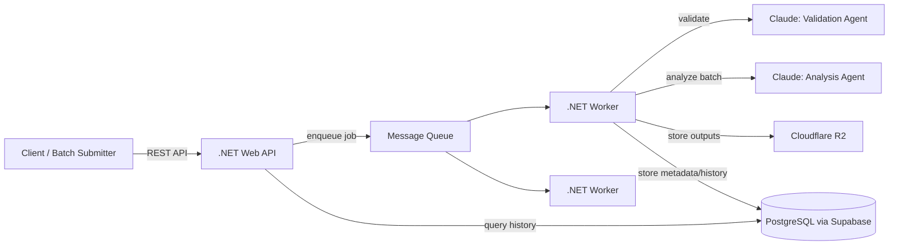

# Image Processing Pipeline

A cloud-native image processing pipeline for game studios and digital asset workflows, built as a portfolio project to learn and demonstrate .NET, Docker, Kubernetes, queue-based worker architecture, multi-agent Claude orchestration, and cloud storage patterns.

**Status:** environment setup in progress — no application code yet.

## Overview

The system accepts image assets (single submission or batch folder/manifest), processes them through a queue-based worker architecture, and produces web-optimized outputs and game achievement artwork. It supports:

- Resizing images to multiple web output dimensions
- Generating achievement artwork (configurable star ratings, color/B&W, multiple sizes)
- Format conversion (PNG → WebP, AVIF)
- Metadata extraction (dimensions, file size, dominant colors)
- Image validation (resolution, aspect ratio, transparency rules)
- Asset diff detection for batch mode (only reprocesses new/changed files)
- Processing history and audit trail via REST API

## Architecture

This diagram will evolve as architecture decisions are made — see the ADRs in the project's Notion workspace.

## Tech Stack

- .NET 8 Web API (C#)
- Docker
- Kubernetes (k3s, local)
- PostgreSQL (Supabase free tier)
- Cloudflare R2 (S3-compatible storage)
- Claude API — multi-agent workers (validation agent, analysis agent)
- GitHub Actions (CI)
- Terraform (introduced progressively)

## Documentation

- Full project brief: [docs/PROJECT_BRIEF.md](docs/PROJECT_BRIEF.md)
- Architecture Decision Records and the learning log are maintained in a private Notion workspace (not public — this is a learning project, and the log reflects an evolving thought process rather than a polished deliverable).

## Setup

Coming soon — instructions will be added as the project is scaffolded.

## Demo

Coming soon — a recorded walkthrough will be linked here once the pipeline is functional.

## Background

Built by Carlos Padilla, a game developer and software engineer, to formalize and expand on prior production experience building an image processing pipeline (achievement artwork generation, multi-size web exports) into a cloud-native architecture using technologies common in current backend/cloud job listings.

All image assets used are personally rendered in Blender from owned models — no third-party IP or real user data is used anywhere in this project.
