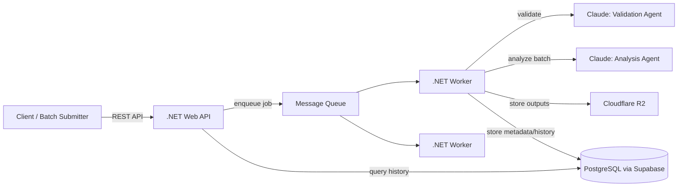
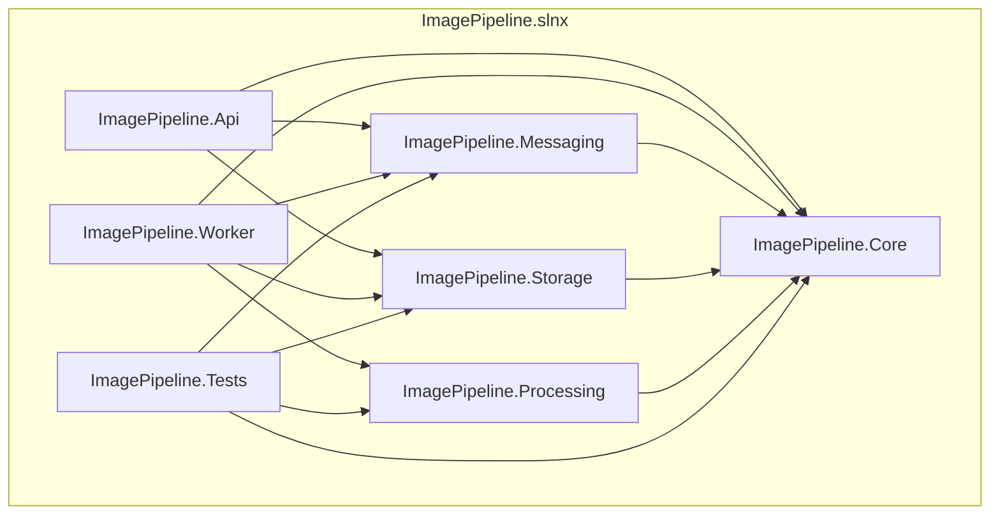

# Image Processing Pipeline

A cloud-native image processing pipeline for game studios and digital asset workflows, built as a portfolio project to learn and demonstrate .NET, Docker, Kubernetes, queue-based worker architecture, multi-agent Claude orchestration, and cloud storage patterns.

**Status:** environment setup in progress — no application code yet.

## Overview

The system accepts image assets (single submission or batch folder/manifest), processes them through a queue-based worker architecture, and produces web-optimized outputs and game achievement artwork. It supports:

- Resizing images to multiple web output dimensions
- Generating achievement artwork (configurable star ratings, color/B&W, multiple sizes)
- Format conversion (PNG → WebP, AVIF)
- Metadata extraction (dimensions, file size, dominant colors)
- Image validation (resolution, aspect ratio, transparency rules)
- Asset diff detection for batch mode (only reprocesses new/changed files)
- Processing history and audit trail via REST API

## Architecture



This diagram will evolve as architecture decisions are made — see the ADRs in the project's Notion workspace.

## Solution Structure



Seven projects: **Api** (REST entry point) and **Worker** (queue consumer, image processor, hosts the Claude agents) both depend on **Core** (shared domain models), **Messaging** (the envelope↔wire-format mapper, RabbitMQ.Client, and Protobuf-generated code), and **Storage** (the `IPresignedUrlProvider`/`IObjectStorage` abstractions and AWSSDK.S3), but never on each other. **Worker** additionally depends on **Processing** (the `IImageProcessor` abstraction and SixLabors.ImageSharp); Api does not. **Messaging**, **Storage**, and **Processing** each depend on Core only (plus their own infrastructure packages), keeping Core itself free of any infrastructure dependency. **Tests** covers Core, Messaging (for `EnvelopeMapper` round-trip tests), Storage (for R2 adapter tests), and Processing (for `ImageSharpProcessor` integration tests). See [ADR-002](https://app.notion.com/p/383ab8331d238116a393e11929c4d334) for the original four-project reasoning, [ADR-019](https://app.notion.com/p/383ab8331d238116a393e11929c4d334) for why Messaging was split out, [ADR-024](https://app.notion.com/p/383ab8331d238116a393e11929c4d334) for Storage's separation, and [ADR-029](https://app.notion.com/p/383ab8331d238116a393e11929c4d334) for Processing's.

## Tech Stack

- .NET 10 Web API (C#)
- Docker
- Kubernetes (k3s, local)
- PostgreSQL (Supabase free tier)
- Cloudflare R2 (S3-compatible storage)
- Claude API — multi-agent workers (validation agent, analysis agent)
- GitHub Actions (CI)
- Terraform (introduced progressively)

## Documentation

- Full project brief: [docs/PROJECT_BRIEF.md](docs/PROJECT_BRIEF.md)
- Architecture Decision Records and the learning log are maintained in a private Notion workspace (not public — this is a learning project, and the log reflects an evolving thought process rather than a polished deliverable).

## Setup

Prerequisites: [.NET 10 SDK](https://dotnet.microsoft.com/download) and either Visual Studio 2026 or VS Code with the C# Dev Kit extension.

```bash
git clone https://github.com/Padintong/image-processing-pipeline.git
cd image-processing-pipeline
dotnet build
```

Open `ImagePipeline.slnx` in Visual Studio 2026, or work from the CLI — both work against the same solution file. The projects (Api, Worker, Messaging, Storage, Processing, Core, Tests) are wired up per [Solution Structure](#solution-structure) above, but there's no real functionality yet; `dotnet build` succeeding is the meaningful check for now. These instructions will expand as the API and worker gain real logic.

## Demo

Coming soon — a recorded walkthrough will be linked here once the pipeline is functional.

## Background

Built by Carlos Padilla, a game developer and software engineer, to formalize and expand on prior production experience building an image processing pipeline (achievement artwork generation, multi-size web exports) into a cloud-native architecture using technologies common in current backend/cloud job listings.

All image assets used are personally rendered in Blender from owned models — no third-party IP or real user data is used anywhere in this project.
